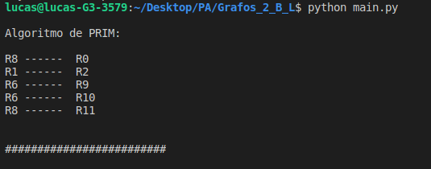
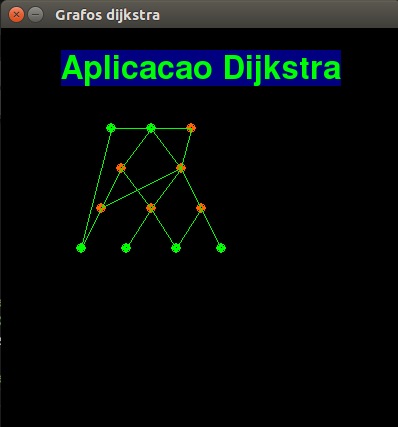

## README

Trabalho 02 - Grafos

Disciplina **Projeto de Algoritimo**

Professor **Mauricio Serrano**

Alunos:

|Nome|Matricula|git|
|--|--|--|
|Brian Lui |15/0006802|[@brian2397](https://github.com/Brian2397)|
|Lucas Machado |15/0015917|[@lmmLucasMachado](https://github.com/lmmLucasMachado)|

### Executar programa

Para executar o projeto basta clonar o repositorio e ir no terminal até a pasta  executar o comando abaixo:

$ python main.py

É necessário ter o [py-game](https://www.pygame.org/docs/) instalado.

### Prints aplicação

